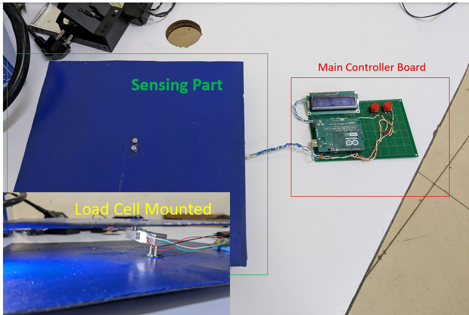
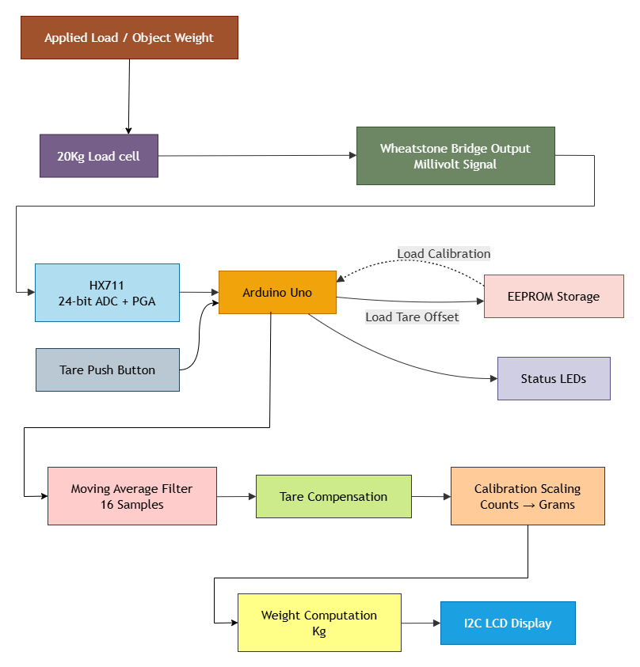
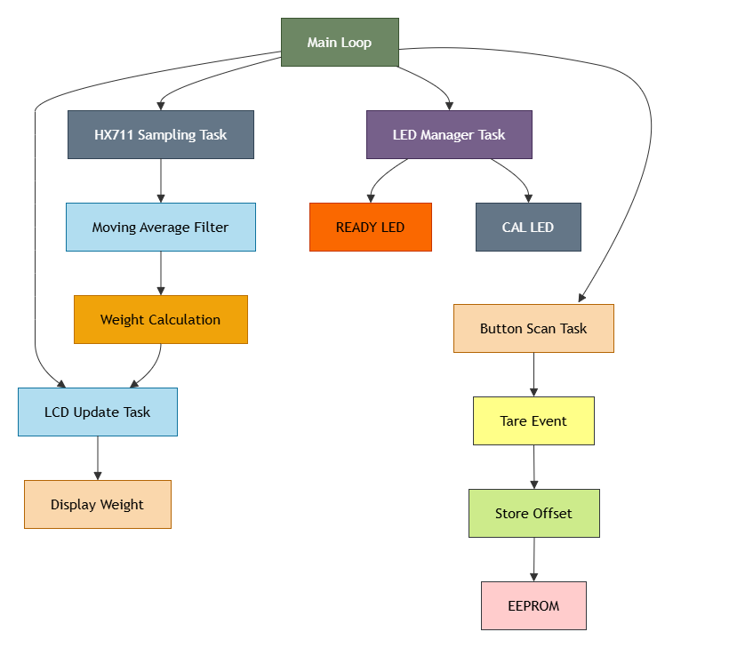
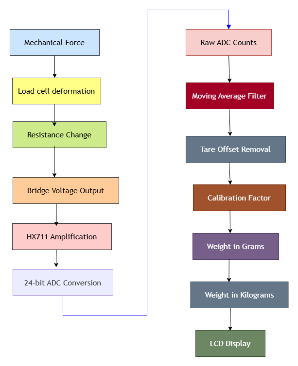
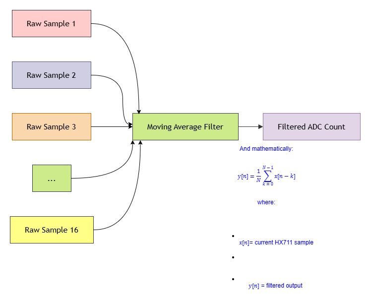
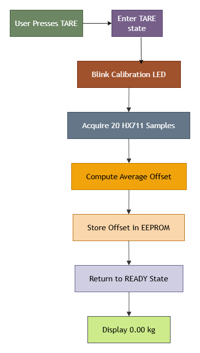
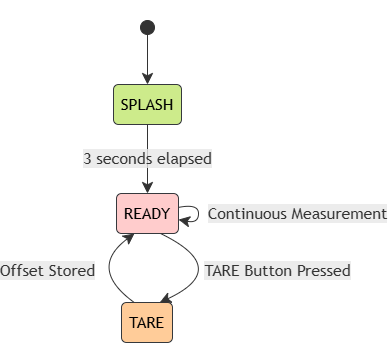

# Design of Digital Weighing Scale System



A low-cost embedded digital weighing scale developed using a 20 kg strain-gauge load cell, an HX711 24-bit ADC module, an Arduino Uno, an I2C LCD display, EEPROM-based calibration storage, and event-driven firmware architecture.

The project demonstrates the complete signal acquisition chain from force measurement to digital weight display. It also implements embedded firmware design principles such as finite state machines (FSM), non-blocking execution, digital filtering, EEPROM persistence, and robust user interaction through a TARE function.

---

# Project Overview

UMUNZANI is a digital weighing system designed to accurately measure weight using a strain-gauge load cell and present the result on an LCD display.

The system performs:

* Load measurement using a 20 kg load cell
* Signal amplification and digitization using HX711
* Digital filtering using a Moving Average Filter (MAF)
* Tare compensation
* Calibration factor scaling
* EEPROM-based parameter persistence
* Real-time weight display
* Non-blocking event-driven firmware execution

---

# System Architecture

## High-Level Functional Overview



The measurement process begins when an external force is applied to the load cell. The resulting mechanical deformation changes the resistance of the strain gauges inside the load cell, generating a small differential voltage.

This signal is amplified and digitized by the HX711 before being processed by the Arduino firmware. The firmware performs filtering, calibration, and tare compensation before displaying the final weight on the LCD.

---

## Firmware Architecture



The firmware is implemented using a cooperative non-blocking architecture.

Instead of using `delay()` functions, periodic tasks are executed based on elapsed time using `millis()`.

Main tasks include:

* HX711 sampling task
* Button scanning task
* LCD update task
* LED management task
* EEPROM management

This architecture improves responsiveness and scalability while maintaining deterministic behavior.

---

# Hardware Components

| Component       | Description                                |
| --------------- | ------------------------------------------ |
| Arduino Uno     | Main microcontroller                       |
| 20 kg Load Cell | Weight sensing element                     |
| HX711           | 24-bit ADC and programmable gain amplifier |
| I2C LCD 16x2    | User interface                             |
| Push Button     | TARE operation                             |
| Status LEDs     | System state indication                    |
| EEPROM          | Persistent calibration storage             |

---

# Working Principle

## Load Cell Operation

A load cell consists of strain gauges configured as a Wheatstone bridge.

When force is applied:

* The strain gauges deform.
* Their resistance changes.
* A differential voltage is generated.

The output voltage is extremely small, typically in the millivolt range. Therefore, direct connection to an Arduino ADC is impractical.

The HX711 module is used to amplify and digitize the signal.

---

## HX711 Signal Conditioning

The HX711 performs two important functions:

### Amplification

The internal Programmable Gain Amplifier (PGA) amplifies the small bridge signal.

### Analog-to-Digital Conversion

The amplified signal is converted into a 24-bit digital value.

The Arduino receives this value as a raw ADC count.

Example raw ADC count:

```text
252415
```

This raw count has no physical meaning until calibration is applied.

---

# Signal Processing Pipeline



The firmware converts raw ADC counts into meaningful weight measurements through multiple processing stages.

These stages include:

1. Raw data acquisition
2. Moving average filtering
3. Tare compensation
4. Calibration scaling
5. Weight calculation
6. Display output

---

# Moving Average Filter (MAF)



Raw HX711 measurements naturally contain electrical noise and quantization fluctuations.

To improve stability, a Moving Average Filter (MAF) is implemented.

The filter uses the latest 16 samples.

Mathematically:

```text
y[n] = (1 / N) * sum(x[n-k])
```

where:

* `x[n]` = current sample
* `N` = 16
* `y[n]` = filtered output

In firmware:

```text
FilteredValue = (Sample1 + Sample2 + ... + Sample16) / 16
```

Benefits:

* Reduced measurement noise
* Improved display stability
* Better repeatability
* Higher user confidence

---

# Tare Compensation



The TARE function allows the user to zero the scale.

Typical use cases:

* Removing container weight
* Eliminating mounting offsets
* Resetting drift

Operation:

1. User presses the TARE button.
2. Firmware enters the TARE state.
3. Twenty HX711 samples are acquired.
4. The average value becomes the new tare offset.
5. The offset is stored in EEPROM.
6. The system returns to the READY state.

The displayed weight becomes:

```text
Weight = Measured Weight - Tare Offset
```

---

# Calibration Procedure

The calibration process determines the relationship between ADC counts and actual weight.

Calibration firmware:

```text
weiCal.ino
```

Procedure:

1. Upload `weiCal.ino`.
2. Remove all weight from the scale.
3. Press TARE.
4. Record the offset value.
5. Place a known weight on the scale.
6. Record the average raw reading.
7. Compute the calibration factor.

Formula:

```text
Calibration Factor = (Raw Reading - Offset) / Known Weight
```

Example:

```text
Known Weight = 900 g
Offset = 159610
Average Raw Reading = 252415
Net Counts = 252415 - 159610
Net Counts = 92805
Calibration Factor = 92805 / 900
Calibration Factor = 103.1167 counts/gram
```

---

# Weight Computation

The final firmware calculates weight using:

```text
Weight (grams) = (Raw Count - Tare Offset) / Counts Per Gram
```

For this implementation:

```text
Counts Per Gram = 103.1167
```

Example:

```text
Weight = (252415 - 159610) / 103.1167
Weight ~= 900 g
Weight ~= 0.90 kg
```

---

# EEPROM Storage

To prevent recalibration after power loss, calibration parameters are stored in EEPROM.

Stored parameters:

* EEPROM signature
* Calibration factor
* Tare offset

At startup:

1. Firmware loads EEPROM data.
2. The signature is verified.
3. Valid calibration values are restored.
4. Normal operation begins.

This ensures calibration persistence across power cycles.

---

# Finite State Machine (FSM)



The firmware uses a Finite State Machine (FSM) architecture.

States:

### SPLASH

Displays:

```text
UMUNZANI
Made in Rwanda
```

### READY

Normal weight measurement.

### TARE

Performs tare acquisition and EEPROM update.

Transitions are event-driven and non-blocking.

---

# Firmware Files

## Calibration Firmware

File:

```text
weiCal/weiCal.ino
```

Purpose:

* Determine tare offset
* Determine calibration factor
* Verify HX711 operation

---

## Production Firmware

File:

```text
Final_Firmware/Final_Firmware.ino
```

Features:

* Non-blocking execution
* FSM architecture
* EEPROM persistence
* Moving Average Filter
* TARE functionality
* LCD user interface
* LED status indication
* Stable weight measurement

---

# Pin Configuration

| Function        | Arduino Pin |
| --------------- | ----------- |
| HX711 DT        | D2          |
| HX711 SCK       | D3          |
| TARE Button     | D4          |
| Calibration LED | D6          |
| Ready LED       | D7          |
| LCD SDA         | A4          |
| LCD SCL         | A5          |

---

# System Startup Sequence

1. Power on
2. Display splash screen
3. Load EEPROM parameters
4. Initialize HX711
5. Start sampling
6. Apply filtering
7. Display weight
8. Wait for user events

---

# Future Improvements

Potential enhancements include:

* Auto-zero tracking
* Battery operation
* Bluetooth connectivity
* Wi-Fi telemetry
* Data logging
* Weight history storage
* Overload alarm
* Calibration menu system
* Industrial enclosure design

---

# Author

Placide Dushimerugaba

Kigali, Rwanda

---

# License

This project is released for educational, research, and product development purposes.
